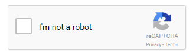

###jrecapatcha-v2

`jrecaptcha-v2` is a Java library for verifying responses from the Google reCAPTCHA version 2 component.



It includes the following Maven modules:
- com.10xdev:jrecaptcha-v2-core: core library with dependency to com.googlecode.gson:gson.
- com.10xdev:jrecaptcha-v2-servlet: JSP/servlet library with an additional dependency to javax.servlet:servlet-api.
- com.10xdev:jrecaptcha-v2-sample: sample servlet.

#### Building
Run `mvn clean package` in the project root.

#### Prerequisites
You will need a reCAPTCHA version 2 site key and secret key, which can be obtained from the [recpatcha console](https://www.google.com/recaptcha/admin#list)

#### Usage

On an HTML page (replacing your-site-key with your site key
```html
<head>
...
	<script src="https://www.google.com/recaptcha/api.js"></script>
</head>

<body>
...
	<form method="post" action="...">
	...
	<div class="g-recaptcha" data-sitekey="your-site-key"></div>
	...
	</form>
...
```

In your Java servlet:

```java
	private ServletRecaptchaVerifier recaptchaVerifier;

	@Override
	public void init(final ServletConfig config) throws ServletException {
		recaptchaVerifier = new ServletRecaptchaVerifier(config.getInitParameter("site-key"),
				config.getInitParameter("secret-key"));
		super.init(config);
	}

	@Override
	protected void doPost(final HttpServletRequest request, final HttpServletResponse response)
			throws ServletException, IOException {
		...
		try {
			final VerificationResult verificationResult = recaptchaVerifier.verifyUserResponse(request);
			if (verificationResult.isSuccessful()) {
				// the check was successful
			} else {
				// the check was NOT successful
			}
		} catch (final AuthorizationException e) {
			// handle error, most likely network related
		}
		...
	}
```

HTTP proxy support
```java
	checker = new ServletRecaptchaVerifier(config.getInitParameter("site-key"),
				config.getInitParameter("secret-key")).withProxy(Type.HTTP, "proxy.bigco.com", 80);
```

#### Running the sample

Before running the sample, you will need to perform the following steps:
- Rename `web.sample.xml` to `web.xml`.
- Edit `web.xml`, replacing `your-site-key` and `your-secret-key` with the site and secret key obtained from the [recaptcha console](https://www.google.com/recaptcha/admin#list).
- Edit `index.html`, replacing `your-site-key` with your site key.